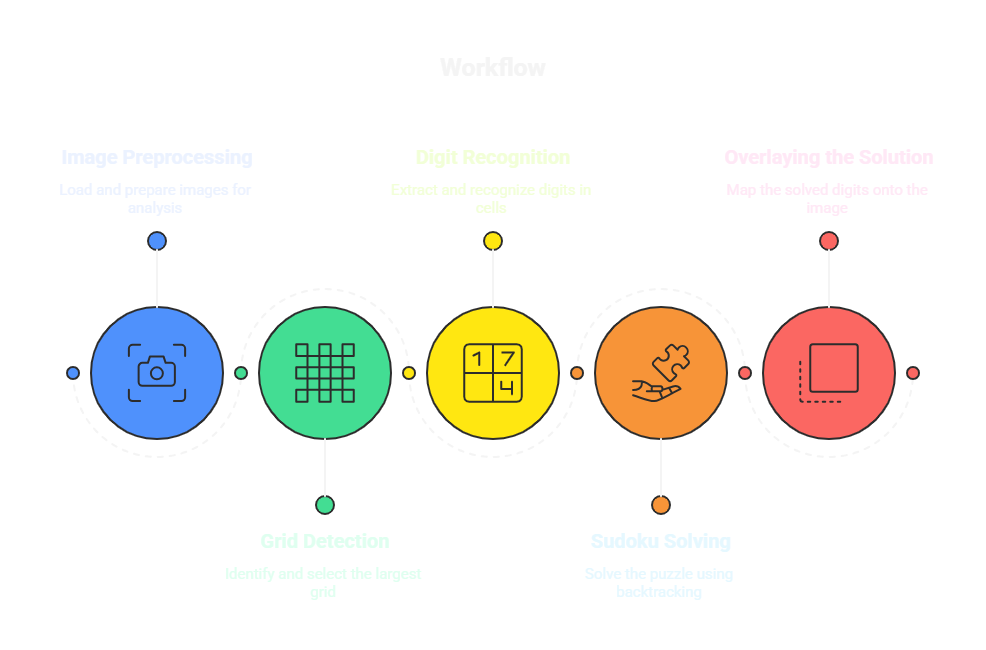

# Sudoku Solver 🧩

This computer vision application solves 9x9 Sudoku puzzles from images through a multi-stage process: It detects and extracts Sudoku grids from input images, recognizes existing digits using Tesseract OCR with custom preprocessing, solves the puzzle using an efficient backtracking algorithm, and finally overlays the digital solution back onto the original image for clear visualization.

<div align="center">
  
</div>


## Installation ⚙️

### Prerequisites
Tesseract OCR installed on your system ([Installation guide](https://github.com/UB-Mannheim/tesseract/wiki))
### Clone the repository
```bash
git clone https://github.com/Monzer-Hw/sudoku-solver.git
```

### Prepare the environment using uv
```bash
uv sync
```
this will create a virtual environment and install the required dependencies.


## Usage 🚀
- Start the FastAPI server:
    ```bash
    uv run uvicorn src.api.main:app --reload
    ```

- Open interactive API docs:
    - `http://127.0.0.1:8000/docs`

- Solve (JSON response):
    ```bash
    curl -F "file=@assets/examples/1.jpg" http://127.0.0.1:8000/solve
    ```

- Solve and return overlaid image (PNG):
    ```bash
    curl -o solved.png -F "file=@assets/examples/1.jpg" "http://127.0.0.1:8000/solve?return_image=true"
    ```


## Project Structure 📁
```
sudoku-solver/
├── assets/
├── notebooks/
│ └── prototype.ipynb
├── src/
│ ├── __init__.py
│ ├── core/
│ │ ├── __init__.py
│ │ ├── detector.py      # Grid detection & processing
│ │ ├── ocr.py           # Digit recognition
│ │ ├── solver.py        # Puzzle solving logic
│ │ └── visualizer.py    # Solution visualization
│ └── api/
│   ├── __init__.py
│   └── main.py          # FastAPI application entry point
├── pyproject.toml            # Dependencies
├── .python-version
├── README.md
├── LICENSE
└── uv.lock 
```


## License 📄
MIT License - See [LICENSE](LICENSE) for details
