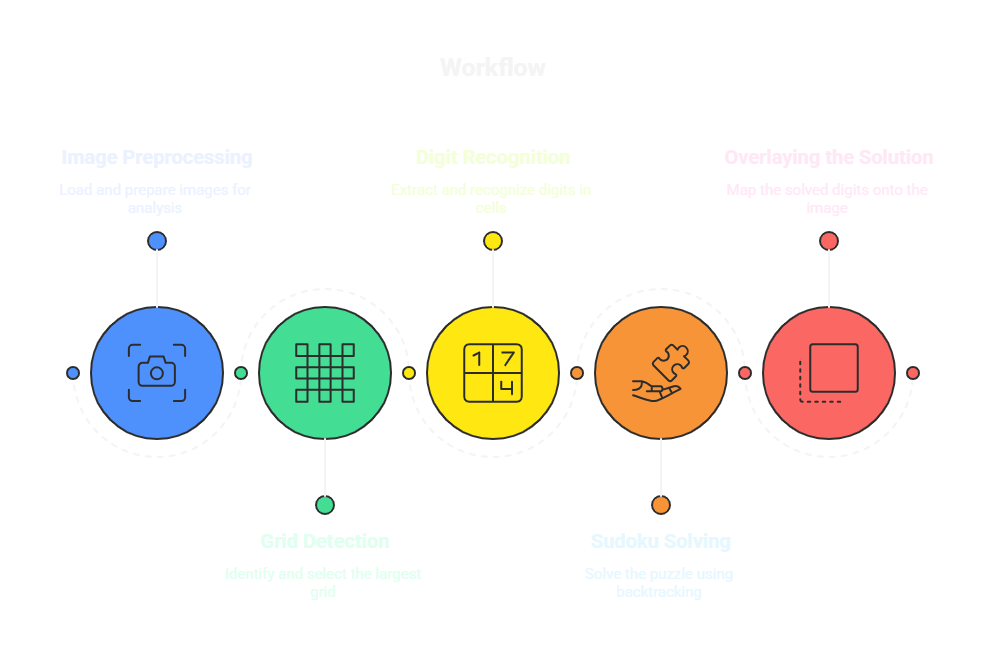

# Sudoku Solver 🧩

This computer vision application solves 9x9 Sudoku puzzles from images through a multi-stage process: It detects and extracts Sudoku grids from input images, recognizes existing digits using Tesseract OCR with custom preprocessing, solves the puzzle using an efficient backtracking algorithm, and finally overlays the digital solution back onto the original image for clear visualization.

<div align="center">
  
</div>


## Installation ⚙️

### Prerequisites
Tesseract OCR installed on your system ([Installation guide](https://github.com/UB-Mannheim/tesseract/wiki))
### Clone the repository
```bash
git clone https://github.com/Monzer-Hw/sudoku-solver.git
```

### Prepare the environment using uv
```bash
uv sync
```
this will create a virtual environment and install the required dependencies.


## Usage 🚀
- Start the FastAPI server:
    ```bash
    uv run uvicorn src.api.main:app --reload
    ```

- Open interactive API docs:
    - `http://127.0.0.1:8000/docs`

- Solve (JSON response):
    ```bash
    curl -F "file=@assets/examples/1.jpg" http://127.0.0.1:8000/sudoku/solve
    ```

- Solve and return overlaid image (PNG):
    ```bash
    curl -o solved.png -F "file=@assets/examples/1.jpg" "http://127.0.0.1:8000/sudoku/solve:image"
    ```

> Tesseract is located via the `TESSERACT_CMD` environment variable, falling
> back to the binary on `PATH` and then to the default Windows install path.


## Testing 🧪
The suite is split into three layers, selectable with pytest markers:

| Marker | Scope |
|--------|-------|
| `unit` | Single module in isolation (solver, detector, OCR, visualizer, config). |
| `integration` | API routes and the core pipeline wired together, with OCR stubbed. |
| `e2e` | Real HTTP requests over real example photos using the installed Tesseract. |

```bash
# Everything
uv run pytest

# Fast feedback: no OCR binary required
uv run pytest -m "unit or integration"

# Full stack against assets/examples (skipped when Tesseract is missing)
uv run pytest -m e2e

# With a coverage report
uv run pytest --cov=src --cov-report=term-missing
```

Lint, format and type checks:
```bash
uv run ruff format --check .
uv run ruff check .
uv run mypy src tests
```


## Continuous Integration 🔁
`.github/workflows/ci.yml` runs on every push to `main` and on every pull request:

- **Lint & format** — `ruff format --check`, `ruff check`, `mypy`.
- **Tests** — unit/integration with a 90% coverage floor, plus the e2e suite
  against a Tesseract installed on the runner; coverage reports are uploaded as
  artifacts.
- **Build** — `uv build` produces the sdist and wheel, which are installed into a
  clean environment to verify the app imports.


## Project Structure 📁
```
sudoku-solver/
├── .github/
│ └── workflows/
│   └── ci.yml              # Lint & format, tests, build
├── assets/
├── notebooks/
│ └── prototype.ipynb
├── tests/
│ ├── conftest.py           # Shared fixtures
│ ├── helpers.py            # Synthetic grid images & board checks
│ ├── unit/
│ ├── integration/
│ └── e2e/
├── src/
│ ├── __init__.py
│ ├── core/
│ │ ├── __init__.py
│ │ ├── detector.py      # Grid detection & processing
│ │ ├── ocr.py           # Digit recognition
│ │ ├── solver.py        # Puzzle solving logic
│ │ └── visualizer.py    # Solution visualization
│ └── api/
│   ├── __init__.py
│   ├── routes/
│   │ ├── __init__.py
│   │ ├── base.py
│   │ └── sudoku.py
│   ├── schemas/
│   │ ├── __init__.py
│   │ └── sudoku.py
│   ├── config.py
│   └── main.py          # FastAPI application entry point
├── pyproject.toml            # Dependencies
├── .env.example
├── requirements.txt
├── .gitignore
├── .python-version
├── README.md
├── LICENSE
└── uv.lock 
```


## License 📄
MIT License - See [LICENSE](LICENSE) for details
